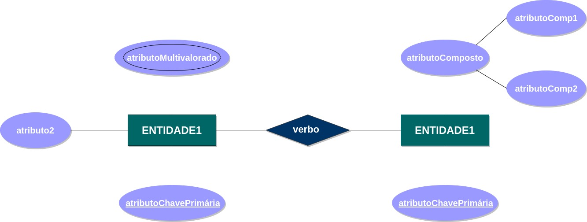

# Diagrama de Entidade-Relacionamento (DE-R)
A estrutura lógica geral de um banco de dados pode ser representado graficamente por um Diagrama de Entidade-Relacionamento (DE-R). O DE-R é composto por:

* Retângulos: representam as **Entidades**
* Losangos: representam os **Relacionamentos**
* Elipses: representam os **Atributos**
* Linhas: ligam as entidades aos seus atributos e as entidades aos seus relacionamentos.

# Estrutura Geral de um DE-R

